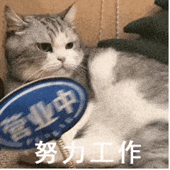

<div align="center">
  
  <h1>Hi, I'm Surise 👋</h1>
  <p>一名来自中国的学生，喜欢把好奇心写成能运行的东西。</p>
  <p>
    <a href="https://surise.cn">个人主页</a> ·
    <a href="https://pan.surise.cn">个人网盘</a> ·
    <a href="https://github.com/Surise">GitHub</a>
  </p>
</div>

<br />

<table align="center">
  <tr>
    <td valign="top" width="52%">

### About me

- 🎓 Student developer from China
- 🧰 Exploring Python, JavaScript, C, HTML, React, PHP and Vue
- 🧪 Interested in turning small ideas into useful tools
- 🌐 Writing and building at [surise.cn](https://surise.cn)

    </td>
    <td valign="top" width="48%">

### Current mindset

> Keep learning, keep shipping, keep the interface simple.

```text
read  →  build  →  test  →  share
```

    </td>
  </tr>
</table>

<br />

### GitHub at a glance

<div align="center">
  
  
</div>

<!-- <div align="center">
  
</div> -->

<br />

<div align="center">
  
  
  
</div>

<br />

<div align="center">
  <sub>Made with curiosity · Updated automatically by GitHub</sub>
</div>
